# slinky-gitops

A working Slurm-on-Kubernetes cluster from nothing, and the credential rotation
nobody wants to be the first to try in production.

```
make up
```

Brings up a three-node KinD cluster, cert-manager, the Slinky operator, and a
Slurm cluster that registers a compute node and runs jobs. Verified on Apple
Silicon — **the Slinky images are multi-arch**, which is not obvious and is the
first thing that stops most people.

---

## What you get

```
$ make job
slinky-0

$ make status          # pods (-o wide) and NodeSets first, then sinfo
…
PARTITION AVAIL  TIMELIMIT  NODES  STATE NODELIST
all*         up   infinite      1   idle slinky-0

$ kubectl -n slurm exec slurm-controller-0 -c slurmctld -- scontrol show node slinky-0
NodeName=slinky-0 Arch=aarch64 CoresPerSocket=11
   …
   State=IDLE+DYNAMIC_NORM
   …
```

(Trimmed where marked `…`. An earlier version of this sample showed the
`scontrol show node` lines as part of `make status`, which never runs
scontrol.)

Versions this was built and tested against, and what `make up` and CI now
install:

| | Built and tested against | Pinned (Makefile) |
| --- | --- | --- |
| Slinky operator and charts | v1.2.0 | `SLINKY_VERSION = 1.2.0` |
| Slurm | **26.05** | the chart's appVersion |
| Kubernetes | v1.32.2 (KinD) | `kindest/node:v1.32.2@sha256:f2263459…` (kind v0.27.0) |
| cert-manager | not recorded | `v1.20.4` |
| Architecture | arm64 and amd64 | |

Until September 2026 nothing was pinned: `make up` and CI installed whatever
was newest, so the CI runs listed below did not necessarily run these versions
(CI used kind-action's default node image, not v1.32.2). Everything is pinned
now, the node image by the digest in the
[kind v0.27.0 release notes](https://github.com/kubernetes-sigs/kind/releases/tag/v0.27.0).
cert-manager 1.20 is the newest line whose
[supported-releases table](https://cert-manager.io/docs/releases/) includes
Kubernetes 1.32; 1.21 starts at 1.33. CI prints `helm list -A` and each
node's kubelet and container-runtime versions on every run (`make versions`),
so each run records the charts and Kubernetes version it tested; it does not
record the node image digest. The pinned
configuration has not been run on a cluster yet (see [Honest scope](#honest-scope)).
`make up SLINKY_VERSION=` (empty) installs the latest instead; a weekly CI job
does exactly that to catch drift.

Slinky v1.2 ships Slurm 26.05, which is worth knowing if you are still planning
a 25.11 upgrade — the Kubernetes path is already a release ahead.

## The thing this repo is actually for



<sub>The six steps run left to right. Five succeed. The Secret carries the new key and
`slurmctld` adopts it, but a newly created `slurmd` pod comes up with the previous key
— so the two daemons hold different keys and cannot authenticate to each other. The
script measures that rather than inferring it, and rolls back.</sub>

### On Slinky the shared secret is auth/slurm, not MUNGE

Search for "rotate Slurm shared secret" and most of what you find is about
MUNGE. On a current Slinky cluster MUNGE is not installed. Verified on the
running deployment:

```
$ scontrol show config | grep -i auth
AuthType            = auth/slurm
CredType            = cred/slurm
AuthAltTypes        = auth/jwt
AuthInfo            = use_client_ids

$ pgrep munged
(nothing)
```

Slurm 23.11 introduced `auth/slurm`, an internal plugin that replaces MUNGE with
a shared key. Slinky ships it as two secrets:

| Secret | Key | Purpose |
| --- | --- | --- |
| `slurm-auth-slurm` | `slurm.key` | Shared cluster auth |
| `slurm-auth-jwt` | `jwt.key` | Signs REST and scrontab tokens |

So the operational hazard is the familiar one, but there is no `munged` to
restart and the secret names are Slinky's.

### Why this is a drain-everything rotation

Slurm itself can rotate `auth/slurm` keys gracefully. Since 24.05 a
`slurm.jwks` file can hold several keys, each with a `kid`, one marked
`"use": "default"`, optionally an `exp`, and the
[authentication docs](https://slurm.schedmd.com/authentication.html) say it
"aids with key rotation, as the cluster does not need to be restarted at once
when a key is rotated. Instead, an scontrol reconfigure is sufficient."
Slinky's own
[architecture doc](https://github.com/SlinkyProject/slurm-operator/blob/v1.2.0/docs/concepts/architecture.md)
names `slurm.jwks` as the rotation mechanism.

Slinky v1.2 has no way to ship that file. Read in the v1.2.0 source of
[slurm-operator](https://github.com/SlinkyProject/slurm-operator/tree/v1.2.0):

- The operator projects exactly one key, `Controller.spec.slurmKeyRef`, as
  `/etc/slurm/slurm.key` into the controller, slurmd, REST API and login pods
  (`internal/builder/*/*_app.go`). The chart's `jwksKeys` setting is for
  `auth/jwt` (a `jwks.json` for REST tokens), not for `auth/slurm`.
- Its admission webhook rejects any change to `slurmKeyRef` after deployment
  (`cannot change SlurmKeyRef after deployment`, `controller_webhook.go`).

With one key there is no overlap window. Between writing the new key and every
daemon reading it, some daemons hold the old key and some the new, and those
two sets cannot authenticate to each other. So the script uses the single-key
method, carefully:

```bash
make rotate-dry   # preflight checks and the plan; changes nothing
make rotate       # do it   (ROTATE_ARGS=--jwt to include jwt.key)
make rollback     # restore the key(s) the last rotation changed
```

1. **Refuses to start unless the cluster is healthy, and fails closed.** It
   checks that `AuthType` really is `auth/slurm` (a MUNGE site is told so and
   stopped), that every NodeSet has all its pods created, updated and ready,
   and that slurmctld answers. A health query that errors is a refusal, not a
   pass. If any Slurm node is already drained, down or not responding it lists
   them and stops unless you pass `--allow-degraded`. Even then it refuses a
   node in any other out-of-service state (reserved, maintenance, powered
   down, …): every slurmd pod is replaced, and Slurm could still start a job
   there that the replacement would kill.
2. **Drains only the nodes that are in service**, with a reason unique to the
   run, and waits until no job is running. "In service" includes Slurm's busy
   variants (`alloc+`, completing; `mix-` and `plnd`, planned by the backfill
   scheduler), not just the bare `idle`/`mix`/`alloc`. If jobs are still
   running at `--timeout`, or `squeue` does not answer, it stops there with
   nothing changed and lifts its drain — only on nodes that still carry its
   own drain reason. A node someone else drains while the run is going (an
   epilog health check, most likely, since the drain wait is when jobs end) is
   handed over: never resumed by the run, its reason put back after every pod
   replacement, and named in an exit 4. The only nodes the script resumes
   without having drained them are nodes that had no drain reason to keep (no
   reason, or Slurm's own "Not responding") and that replacing their pod set
   DOWN; each is resumed once so the run does not leave it DOWN.
3. **Backs up the current key, and stages the new one, before the live Secret
   is deleted.** The backup (`slurm-auth-slurm-previous`) is immutable,
   labelled, and records which keys this run changed. The replacement is
   created as `slurm-auth-slurm-next` and read back before the live Secret is
   deleted, so both keys exist in the cluster at every moment. No key ever
   appears on a command line: manifests go to `kubectl create -f -` on stdin.
4. **Restarts every daemon that holds the key** — including slurmd, which
   `kubectl rollout restart` does not reach (see below).
5. **Verifies by measurement, not inference.** It hashes `slurm.key` on disk
   inside *every* slurmd pod and inside slurmctld and compares the hashes to
   the Secret; a pod it cannot read is a failure, not a skip. Then it requires
   *every* node it drained (and still holds; see step 2) to reach a genuinely
   schedulable state. Earlier
   versions checked proxies for this and passed while the cluster was dead.
6. **Rolls back automatically** if any of that fails: restores the previous
   key, cycles slurmd again, and runs the same measurements against it.
7. **Tries to leave a working cluster on every exit path, and says when it
   could not.** An exit trap lifts the run's drain, recreates a live Secret
   if the run was interrupted between deleting and recreating it, and puts
   back any earlier drain reason that replacing a slurmd pod overwrote. When
   one of those fails (the offline tests include a live Secret that cannot be
   recreated), it exits 4, prints which Secrets are present or missing, and
   names the `--rollback` command that repairs it.

Exit codes are part of the interface: `0` rotated and verified, `1` refused or
aborted with the original key in place, `2` usage error, `3` the new key did
not take and the previous key was restored *and verified*, `4` the result
could not be verified and needs a human — including when a node the run
drained was drained by someone else during it and so could not be verified.
Exit 1 is checked, not assumed: if the run dies unexpectedly after the key
changed, the trap measures the live Secret and reports 4 instead. `--help`
prints all of this.

> **Status: the rotation does not currently succeed on Slinky v1.2.** Replacing
> the Secret does not reach slurmd, for reasons documented in full under
> [What CI caught](#what-ci-caught). The script detects that and rolls back
> instead of reporting success, and exits 3. Read that section before using
> this on anything you care about.

Rotating `jwt.key` (`--jwt`) additionally invalidates every outstanding REST
token. That is the point of a credential rotation, but it will page whoever
automated against the API, so it is opt-in. Two more things from the v1.2.0
source, neither measured on a cluster here: the operator signs its own REST
token from `jwt.key` and refreshes it every 12 minutes (15-minute lifetime,
refreshed at 4/5; `slurmclient_sync.go`), so its REST calls may be rejected
until then; and auth-token Secrets generated by the operator carry an
ownerReference to the JWT key Secret (`BuildTokenSecret`), which is why the
script deletes the live Secret with `--cascade=orphan` — a default delete
would have the garbage collector take those tokens with it. For `jwt.key` the
script verifies the file hash inside slurmctld; it does not mint a token and
call the REST API.

`--rollback` is also the repair path after an interrupted run. It recreates a
missing live Secret from the backup (labels, annotations and the immutable
flag included), and takes back nodes whose only problem is one a rotation
causes (this script's drain, the slurmd preStop reason, not responding); a
node drained for any other reason still needs `--allow-degraded` and is left
alone.

`--cleanup` deletes the backup and staging Secrets once you no longer need to
roll back. It refuses while a live auth Secret is missing, because then a
backup may hold the only copy of a key.

The permissions the script needs, as a namespaced Role derived from the
kubectl calls it makes, are in
[docs/rbac-rotate-auth-key.yaml](docs/rbac-rotate-auth-key.yaml): Secrets
get/list/watch/create/delete (never update: they are immutable; list and
watch because `kubectl delete --wait` watches the Secret until it is gone),
pods and `pods/exec`, rollout on the controller and REST API, and reading
NodeSets. `make test` checks the Secrets rule against the calls the script
makes on the fake cluster. It has not been tested against a restricted
account; `make rotate-dry` cannot do that, since a dry run never deletes,
creates or execs anything, so try a real `make rotate` and `make rollback`
with it on a disposable cluster first.

## Things that only show up when you run it

**The auth secrets are immutable.** Slinky sets `immutable: true`, so
`kubectl patch` is rejected outright:

```
The Secret "slurm-auth-slurm" is invalid:
  data: Forbidden: field is immutable when `immutable` is set
```

The only way to change one is delete-and-recreate, carrying the labels and
annotations over, since Helm records release ownership there. The first version
of this script patched, failed here, and left the cluster drained — which is
why the exit trap exists.

**Recreating an immutable secret silently drops the flag.** Deleting and
recreating gets you a working, *mutable* secret. Everything keeps running, so
nothing tells you the cluster's posture just weakened. The script carries the
flag over. That used to be verified by hand, by rotating twice and checking
`immutable` was still `true`; now CI compares the Secret's key hash, immutable
flag, labels and annotations before and after every rotation and rollback
(`scripts/ci/assert-rotation.sh`), and the offline tests do the same.

**PIDs, secrets and node registration are all asynchronous.** A node takes
noticeably longer to appear in `sinfo` than its pod takes to reach `Running`.
`make slurm` waits for actual registration rather than pod readiness, because
pod-ready is not cluster-ready. The wait and the rotation script share one
definition of "schedulable" (`scripts/lib/nodes.sh`), anchored at both ends —
the bring-up gate used to accept `idle*`.

**Replacing a slurmd pod rewrites the node's reason.** The slurmd container's
preStop hook runs `scontrol update nodename=$(hostname) state=down
reason='slurm-operator: Pod is terminating'` (`worker_app.go` in v1.2.0). A
node that a GPU health check had drained with a meaningful reason loses that
reason the moment its pod is replaced, whoever replaces it. The script records
such reasons before it starts, re-reads them just before it replaces the
pods (so a drain set while it waited for jobs is not mistaken for its own),
and puts them back right after each replacement. It matches that preStop
reason exactly: the operator sets other `slurm-operator: ` reasons too, for
example when a Kubernetes node is cordoned, and those are drains the script
must not lift.

**A verification that does not cross the broken boundary always passes.** This
one cost several CI runs and is the most useful thing in the repo — see below.

## What CI caught

Every run of this repository's workflow, from the public Actions API (fetched
2026-09-26; step times are the API's `started_at`/`completed_at`):

| Run | Commit | Result | What happened |
| --- | --- | --- | --- |
| [30222807733](https://github.com/Zhanyl-tech/slinky-gitops/actions/runs/30222807733) | `52c3aa4` | cancelled | Deploy Slurm ✓ 71 s, rotation "✓" 15 s, then the job after it hung 1656 s until the 30-minute job timeout |
| [30227714447](https://github.com/Zhanyl-tech/slinky-gitops/actions/runs/30227714447) | `1d40ac9` | cancelled | same shape: rotation "✓" 43 s, job after it hung 2558 s (≈43 min) until the 45-minute job timeout |
| [30229797795](https://github.com/Zhanyl-tech/slinky-gitops/actions/runs/30229797795) | `d5014b2` | failure | rotation "✓" 14 s, job after it failed at 121 s (`srun --immediate=120` giving up) |
| [30232506647](https://github.com/Zhanyl-tech/slinky-gitops/actions/runs/30232506647) | `8d22ade` | failure | rotation step "✓": `make rotate` exited non-zero after 369 s; the next job failed at once (the `8e742be` commit message: "rotation correctly refused and rolled back, then the next job died with 'container not found (slurmctld)'") |
| [30233223918](https://github.com/Zhanyl-tech/slinky-gitops/actions/runs/30233223918) | `8e742be` | success | rotation step "✓": exited non-zero after 404 s; job ran afterwards |
| [30672162435](https://github.com/Zhanyl-tech/slinky-gitops/actions/runs/30672162435) | `044e01c` | success | same (410 s) |
| [31267694590](https://github.com/Zhanyl-tech/slinky-gitops/actions/runs/31267694590) | `c51903a` | success | same (419 s) |

For runs 4-7 the API gives only the step's result and times. At those commits
the step was `if make rotate; then exit 1; fi`, so its "✓" means only that the
rotation exited non-zero. 369-419 s is consistent with the script's 300 s
propagation wait plus a rollback, but the logs were not re-read (an anonymous
download through the API returns HTTP 403, checked 2026-09-26), so the table
does not claim which check fired.

Four runs failed here, all on my code rather than on Slinky, and they are the
same mistake wearing different clothes.

**Runs 1 and 2 — the rotation said ✓ and the next job waited forever.** The
first write-up of Run 1 blamed an unbounded wait for node registration and a
2 vCPU / 7 GB runner. The step record says otherwise: "Deploy Slurm", which
contains that wait, finished in 71 s; the hang was the `srun` *after* the
rotation, which queued for a node that never came back and had no timeout.
(GitHub [documents](https://docs.github.com/en/actions/reference/runners/github-hosted-runners)
4 vCPU / 16 GB for Linux runners on public repositories.)
The registration wait was bounded anyway (`REGISTER_TIMEOUT`, default 600 s,
dumping pod state on failure), which is still right, and CI moved to a
single-worker topology on that mistaken diagnosis; `kind/cluster-ci.yaml` now
says why it is kept. What `srun` was waiting on (quoted in the `d5014b2`
commit message as what Run 2 showed):

```
srun: Required node not available (down, drained or reserved)
```

`make job` has used `srun --immediate` since `d5014b2`, which turned the next
occurrence (Run 3) into a failure after 121 s instead of a hang.

**Runs 1 to 3 — the rotation reported success on a cluster that could not run
a job.** Every step printed a green tick and `Rotation complete` scrolled past.
Chasing that down turned up four defects in my own script and one in Slinky
that I still cannot fully explain.

### The checks that could not fail

Rotation can only break one thing: the controller↔slurmd trust relationship,
since that is what the rotated key authenticates. Two verification attempts
both missed it, the same way:

| Check | Why it passed anyway |
| --- | --- |
| `sinfo` exits 0 | Never leaves the controller pod. `slurmctld` answers a local client whether or not a single node came back — it passes against zero compute. |
| No `*` on any node state | Crosses the boundary, but raced the restart. It passed **130 ms** after the rollout, reading the node as it was *before* the new key applied. |

A third was subtler: `grep -E '^(idle|mix|alloc)'` also matches **`idle*`**, and
that trailing `*` means *slurmctld cannot reach the node* — the precise failure
the check existed to catch. It is anchored at both ends now.

A fourth: the wait for replacement pods had no success flag, so on timeout it
fell out of the loop straight into the line that prints a green tick. Every one
of these is the same bug — **a check that cannot fail.**

The September 2026 audit of this repository found more of the same, now fixed
and covered by tests: the drain wait fell through on timeout and printed "no
running jobs" (then deleted pods under live jobs); a failed `squeue` counted as
zero jobs; a failed NodeSet query counted as converged; a slurmd pod that could
not be exec'd was skipped, so one good pod certified the rest; one schedulable
node certified all of them; and the CI step itself (`if make rotate; then exit
1; fi`) passed on any failure, including a syntax error.

**Run 4 — the rollback returned too early.** As recorded in the `8e742be`
commit message at the time, the rotation correctly refused and rolled back,
then the next job died with `container not found ("slurmctld")`: the rollback
restarted the controller and returned before it was back. Since then every rollback waits for the controller and resumes
until nodes are schedulable. (`make rollback`, the manual path, still skipped
all of that until the audit: it restarted the built-in workloads only, never
cycled slurmd, never resumed a node, and exited 0 without measuring anything.
It now runs the same routine as the automatic rollback, and CI exercises it.)

### `rollout restart` never restarted slurmd

```
$ kubectl -n slurm get statefulset,deployment,daemonset -l app.kubernetes.io/instance=slurm
statefulset.apps/slurm-controller
deployment.apps/slurm-restapi
$ kubectl -n slurm get pod slurm-worker-slinky-0 -o jsonpath='{.metadata.ownerReferences[*].kind}'
NodeSet
```

`NodeSet` is a CRD, so `kubectl rollout restart` — which only knows built-in
kinds — silently skipped the one daemon on the far side of the boundary being
rotated. The controller adopted the new key in seconds and slurmd kept the old
one. Deleting the pods is the supported way to cycle them.

And replacing a slurmd pod leaves the node **down**, not drained:

```
$ sinfo -R
slurm-operator: Pod   root   2026-07-27T01:41:40   slinky-0
```

The operator sets that and never clears it — ninety seconds of watching showed
no self-heal. (`sinfo -R` shows only the first 20 characters of a reason. The
full one is most likely `slurm-operator: Pod is terminating` from the slurmd
preStop hook, which sets the node DOWN; the operator's own cordon path drains
instead.) So an explicit
`RESUME` is mandatory after any pod replacement, and it must be re-issued
rather than fired once.

### The part I could not fix: the key does not propagate

With all of that corrected, rotation still fails — and now says so. On a clean
KinD cluster, with the Secret holding a new key and stable for five minutes, a
slurmd pod deleted and recreated from scratch came up mounting the **previous**
key:

```
secret                        sha c5016281…
slurmd pod created 02:28:25   sha 8cbda076…    ← the pre-rotation key
slurmctld                     sha c5016281…    ← correct
```

with `_fetch_child: failed to fetch remote configs: Protocol authentication
error` in the slurmd log until the node went down.

Slinky ships the auth Secret `immutable: true`, so its data cannot be patched
and delete-and-recreate is the only route. What I checked, so the record is
honest about what is and is not established:

- **Not the operator rewriting the Secret** — it held one value, `rv` unchanged, for 90s.
- **Not the replacement's flag** — recreating the replacement as *mutable* behaved identically. (That rules out the new object's immutability, not the old one's; see below.)
- **Not universal** — the same delete-and-recreate against a Secret that node had never cached propagates immediately, which is why a naive control test made me dismiss this too early.

**Best current explanation (a hypothesis from reading the code, not yet
reproduced in isolation).** The kubelet's default Secret strategy is `Watch`
([kubelet config](https://kubernetes.io/docs/reference/config-api/kubelet-config.v1beta1/)),
backed by a per-node cache keyed by namespace/name
([`watch_based_manager.go` at v1.32.2](https://github.com/kubernetes/kubernetes/blob/v1.32.2/pkg/kubelet/util/manager/watch_based_manager.go)):

- `Get()`: once the cached object is immutable, the item is marked immutable
  and its watch stopped ("Stopped watching for changes - object is immutable").
- `restartReflectorIfNeeded()` returns early for an immutable item, so the
  watch never restarts and the cache keeps the old object.
- `DeleteReference()` drops the item only when no pod on that node references
  the name any more.

So once a node has cached `slurm-auth-slurm` as immutable, every new pod there
gets the cached bytes for as long as *some* pod on that node (the controller,
the REST API, a terminating slurmd) still mounts that name. That predicts all
three observations above: the replacement's flag does not matter, and a node
that never cached the Secret fetches it fresh. The Kubernetes docs say as much
in passing: after deleting and recreating an immutable Secret, "Existing Pods
maintain a mount point to the deleted Secret - it is recommended to recreate
these pods"
([Secrets](https://kubernetes.io/docs/concepts/configuration/secret/#secret-immutable)).
Experiments that would confirm or kill it, none run yet:

1. Put slurmd alone on a worker (no other pod mounting `slurm-auth-slurm`
   there) and rotate. Prediction: it propagates.
2. After recreating the Secret, restart the kubelet on slurmd's node
   (`docker exec <node> systemctl restart kubelet`). Prediction: it propagates.
3. Run that kubelet at `-v=4` and look for `Stopped watching for changes -
   object is immutable`.
4. Install with `slurmKey.create: false` and a pre-created *mutable* Secret
   via `slurmKey.secretRef`. Prediction: it propagates, because the cache item
   never becomes immutable.

Pod placement decides the outcome under this hypothesis, and CI (one worker,
everything co-located) differs from `make up` (two workers), so the script
prints `kubectl get pods -o wide` when it rolls back. In CI that listing is in
the rotation step's log on every run (and "Record what this run tested"
prints `kubectl get pods -A -o wide` before it); the diagnostics artifact,
which also holds `rotate.log`, is uploaded only when a step fails, which the
expected rollback does not. An anonymous download of the step logs through
the API returns HTTP 403 (checked 2026-09-26).

**What the script does about it:** it reads the key off disk inside every
slurmd pod and in slurmctld and compares it to the Secret. On mismatch it
rolls back, verifies the rollback the same way, and exits 3. That is the whole
point — a rotation that cannot work must not print a green tick, because
"answers `sinfo`, cannot run a job" is the worst state to hand someone.

**What a real fix needs.** An earlier version of this README proposed
versioned Secret names ("repoint the NodeSet") as a chart-level change. That
does not work on v1.2: NodeSets carry no key reference (slurmd's volume uses
the Controller's `slurmKeyRef`), and the webhook forbids changing
`slurmKeyRef` after deployment, so the Secret name is fixed at install. What is
available today: choosing `slurmKey.secretRef` at install; a mutable,
user-managed Secret (only helps if the hypothesis above is right — experiment
4); restarting the kubelet, or moving every Slurm pod off a node, before the
new slurmd pod starts there. What needs upstream work: a way to project
`slurm.jwks`, a key-hash annotation on NodeSet pods like the controller
already has, or a permitted `slurmKeyRef` change. An issue for
SlinkyProject/slurm-operator is drafted in
[docs/upstream-issue-draft.md](docs/upstream-issue-draft.md); it has not been
filed.

CI asserts the safety property rather than a success it cannot have: the
rotation must exit 3, for the documented reason, with the Secrets exactly as
they were; the cluster must then run a job; `make rollback` must cycle slurmd,
verify, and retire the backup; and the same must hold for `--jwt`. A weekly
job repeats this against the latest charts, and fails if the rotation starts
succeeding there.

The general form is worth more than any single bug: **a check that does not
cross the boundary you might have broken will pass no matter what you broke.**
Green ticks on a dead cluster are worse than a red one, because they stop you
looking.

## Tests

```
make test    # offline: the rotation script against a fake kubectl (39 scenarios, 92-98 s on a Mac)
make lint    # bash -n and shellcheck on every shell script
```

`tests/run.sh` runs the real script against `tests/fake/kubectl.py`, a fake
cluster that models the behaviour the script depends on: immutable Secrets
that can only be deleted and recreated, owner-reference garbage collection,
the slurmd preStop hook, the stale-key failure, and Slurm's DRAIN/RESUME
rules, including Slurm's busy state suffixes (`alloc+`, `mix-`, `plnd`). It
covers the paths the KinD job cannot reach — drain timeouts, API errors and a
SIGTERM between deleting and recreating the live Secret, pre-drained nodes, a
health check draining a node mid-run (during the drain wait, after the pod
replacement, and on the timeout path), unreadable pods, jwt scoping, key
material on the command line, the Role's Secret verbs against the calls the
script makes — and checks that the CI assertion itself fails on the wrong
failure. It
cannot tell you whether a real cluster behaves like the fake; that is what the
KinD job is for.

## Layout

```
Makefile                         make up / job / rotate / rollback / test / lint / down
values/slurm.yaml                cluster shape, in git rather than --set flags
kind/cluster.yaml                local topology: control plane + 2 workers
kind/cluster-ci.yaml             CI topology: control plane + 1 worker (and why)
scripts/rotate-auth-key.sh       the rotation, rollback and cleanup
scripts/lib/authkey.py           builds Secret manifests from stdin (keys never in argv)
scripts/lib/nodes.sh             one definition of "schedulable", shared
scripts/wait-node-registered.sh  `make slurm`'s bounded registration wait
scripts/ci/                      CI assertions, manifest validation, diagnostics, YAML check
tests/                           offline tests and the fake kubectl
docs/auth-rotation.svg           the diagram above
docs/upstream-issue-draft.md     the issue this repo would file upstream
docs/rbac-rotate-auth-key.yaml   the Role the rotation script needs (untested)
CHANGELOG.md
```

Values live in a file on purpose. A cluster defined by a string of `--set`
arguments in someone's shell history is not reviewable and not reproducible.
CI renders them with the pinned chart and validates the result against the
Kubernetes schemas and the pinned Slinky CRDs (`scripts/ci/validate-manifests.sh`).

## Requirements

`docker`, `kind` (CI uses v0.27.0, the release the pinned node image was
published with), `kubectl`, `helm` (CI uses v3.19.0), and for the rotation
script `bash` (3.2 or newer, so macOS's works) and `python3` (3.8 or newer,
standard library only). Roughly 6 GB free for Docker. No GPU and no real Slurm
cluster needed.

For the checks rather than the cluster: `make test` needs only `bash` and
`python3`. `make lint` needs `shellcheck` (CI pins `shellcheck-py==0.11.0.1`;
`make lint SHELLCHECK=...` points it at another binary).
`scripts/ci/validate-manifests.sh` needs `helm`, `kubeconform` (CI uses
v0.8.0) and a Python with PyYAML (`PYTHON=...`), as do
`scripts/ci/check-yaml.py` and `scripts/ci/crd2schema.py`.

## Honest scope

- **KinD only, so far.** The Helm values and rotation apply to any Kubernetes,
  but the bring-up path is local. Cloud is the obvious next step.
- **Not re-run on a cluster since the September 2026 changes.** The scoped
  drain, the staged Secret replacement and the stricter measurements are
  covered by the offline tests (against a fake kubectl) and by shellcheck.
  Pinning is checked offline only as far as `scripts/ci/validate-manifests.sh`
  goes: it renders the pinned Slinky chart and validates the output. Nothing
  offline pulls the pinned node image or the cert-manager chart, and the new
  steps of the KinD CI job are not exercised by anything offline; the KinD job
  has to run once before any of this counts as proven on a real cluster.
- **One nodeset, one replica.** Enough to prove registration and job execution;
  multi-nodeset scheduling, GPU (GRES) classes and autoscaling profiles are not
  built.
- **No GitOps controller.** The "GitOps" in the name is aspirational — this is
  declarative and reproducible, but applied by Make rather than reconciled by
  a controller. Wiring Argo CD to `values/` as-is would not work: the chart
  generates both keys with `lookup` plus `randAscii 1024`; Helm does not
  contact the API server during `helm template`, so `lookup` finds nothing
  ([Helm docs](https://helm.sh/docs/chart_template_guide/functions_and_pipelines/));
  and Argo CD inflates charts with `helm template`, so every comparison would
  see new keys. Its docs say an app whose chart generates random values "will
  always be in an `OutOfSync` state"
  ([Argo CD Helm guide](https://argo-cd.readthedocs.io/en/stable/user-guide/helm/)).
  Measured: two `helm template` renders of chart 1.2.0 with these values
  (helm v3.19.0, 2026-09-26; one from the published OCI chart, one from the
  v1.2.0 tag's source, otherwise identical output) gave different 1024-byte
  `slurm.key` and `jwt.key` values. The keys would
  have to come from outside the chart (`slurmKey.create: false` plus an
  external secret store), with the Secret name decided on day 0 because
  `slurmKeyRef` cannot change afterwards.
- **Not measured by the script:** the REST API pod also mounts `slurm.key`,
  but whether its container user can read the 0600 file has not been checked,
  so it is not hashed; `--jwt` is verified by the file hash in slurmctld, not
  by an authenticated REST call.
- **No login node or accounting.** Jobs are submitted from the controller pod.
  A `LoginSet` CR exists in the CRDs and is not deployed here; neither is
  slurmdbd, which would also need the key.

## The set

Part of a set of tools covering the lifecycle of a GPU allocation, each built on
the same rule — never act on absent evidence:

- **slinky-gitops** — this repo. Running Slurm on Kubernetes.
- **[gpu-reaper](https://github.com/Zhanyl-tech/gpu-reaper)** — wasted GPUs during a job.
- **[ib-slurm-exporter](https://github.com/Zhanyl-tech/ib-slurm-exporter)** — fabric problems attributed to the job.
- **[epilog-gpu-validator](https://github.com/Zhanyl-tech/epilog-gpu-validator)** — GPU hardware faults between jobs.
- **[slurm-scheduler-lab](https://github.com/Zhanyl-tech/slurm-scheduler-lab)** — the scheduling policy behind it all.

## License

MIT
